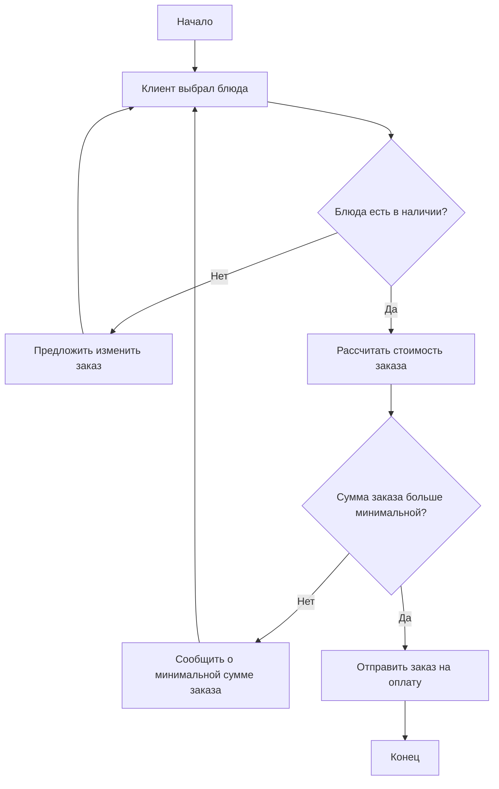

# Flowchart — Проверка возможности оформления заказа

Блок-схема алгоритма проверки заказа перед передачей на кухню.

**Элементы:** старт, условия ветвления (наличие блюд, минимальная сумма заказа), обработка каждого условия и завершение алгоритма.
