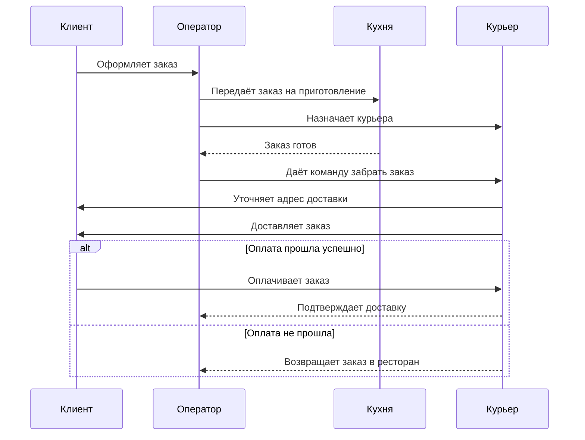
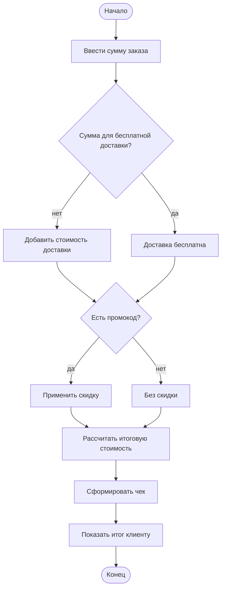

# Лабораторная работа №1

## 1. Краткое описание процесса

Процесс описывает оформление заказа еды в ресторане и его доставку клиенту.

**Участники (роли):** Клиент, Оператор ресторана, Кухня, Курьер.

**Шаги процесса:**

1. Клиент выбирает блюда и оформляет заказ через сайт или приложение.
2. Оператор принимает заказ и проверяет наличие выбранных блюд.
3. Если блюдо недоступно, оператор предлагает замену; при отказе клиента заказ отменяется.
4. Оператор подтверждает заказ и передаёт его на кухню.
5. Кухня начинает готовить блюда, одновременно оператор назначает курьера и оформляет доставку.
6. Кухня упаковывает готовый заказ.
7. Курьер забирает заказ и доставляет его клиенту.
8. Клиент оплачивает заказ при получении.
9. Если оплата не прошла, заказ возвращается в ресторан и отменяется.
10. Клиент получает заказ — процесс завершён.

Полное описание: [`docs/process_description.md`](docs\process_description.md)

---

## 2. Диаграммы

### 2.1. BPMN-диаграмма


- **Изображение (PNG):** [`diagrams/process-bpmn.png`](diagrams/diagram.svg)
- **Исходный файл:** [`diagrams/process.bpmn`](diagrams/process.bpmn) (XML, нотация BPMN 2.0)
- **Элементы:** стартовое событие, **9 задач**, **5 шлюзов** (3 исключающих XOR + 2 параллельных AND), 3 конечных события
- **Ветвления (XOR):** «Блюдо доступно?», «Клиент согласен?», «Оплата прошла?»
- **Параллельные действия:** «Готовить блюда» и «Назначить курьера» выполняются одновременно (шлюзы AND)

### 2.2. UML Activity Diagram


- **Изображение (PNG):** [`diagrams/activity-uml.png`](diagrams/activity-uml.png)
- **Исходный файл:** [`diagrams/activity.drawio`](diagrams/activity.drawio)
- **Детализирует шаг:** «Проверка наличия блюд и подтверждение заказа»
- **Элементы:** начальный узел, **6 действий**, **2 решения** (ромбы), конечные узлы
- **Цикл:** при согласии клиента на замену поток возвращается обратно к действию «Подтвердить заказ»

### 2.3. Sequence Diagram (Mermaid)

**Исходный файл:** [`docs/sequence.md`](docs/sequence.md)



- **4 участника** (lifelines), **10 сообщений**, **1 блок `alt`** (ветвление по оплате)

### 2.4. Flowchart (Mermaid)

**Исходный файл:** [`docs/flowchart.md`](docs/flowchart.md)



- **Алгоритм:** расчёт итоговой стоимости заказа
- **2 условия ветвления:** бесплатная доставка, наличие промокода

---

## 3. Структура репозитория

```
visual-programming-labs-Sniahurski/
├── README.md
└── lab1/
    ├── docs/
    │   ├── process_description.md
    │   ├── sequence.md
    │   └── flowchart.md
    ├── diagrams/
    │   ├── process.bpmn
    │   ├── process-bpmn.png
    │   ├── activity.drawio
    │   └── activity-uml.png
    └── report.md
```

---

## 4. Работа с Git, сравнение текстовых и бинарных форматов (`git diff`)

Чтобы увидеть разницу, были внесены небольшие изменения в диаграммы и выполнен `git diff`:

```bash
git diff HEAD~1 -- lab1/diagrams/process.bpmn
git diff HEAD~1 -- lab1/diagrams/process-bpmn.png
```

**Результат:**

| Формат | Тип | Как Git показывает изменения |
|---|---|---|
| `.bpmn` (XML) | текстовый | Построчно: видно добавленные/изменённые строки (`+`/`−`), можно прочитать, что именно поменялось |
| `.drawio` (XML) | текстовый | Построчно: видно новую фигуру и связи |
| `.md` (Mermaid) | текстовый | Построчно: видно каждое добавленное сообщение/шаг |
| `.png` | **бинарный** | Только `Binary files a/... and b/... differ` — без деталей |

**Вывод по этому пункту:** текстовые исходники диаграмм (BPMN XML, .drawio, Mermaid) удобно версионировать — изменения читаемы и осмысленны в истории. Бинарные PNG для сравнения версий практически бесполезны: Git видит только факт изменения файла.

---

## 5. Выводы
В ходе работы я научился базовым командам git. Также убелиося, что текстовые форматы диаграмм удобнее использовать, чем бинарные: в git diff для .bpmn видно конкретные строки, а для .png  только тот факт что файл измененялся.
