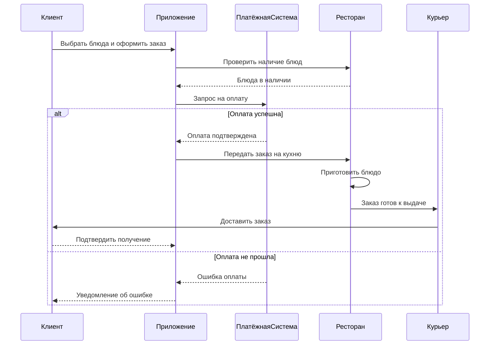

# Sequence Diagram — Заказ еды с доставкой

Диаграмма последовательности показывает обмен сообщениями между участниками при оформлении и оплате заказа.

**Участники:** Клиент, Приложение, ПлатёжнаяСистема, Ресторан, Курьер (5 участников).

**Сообщения:** 8 сообщений, из них один блок `alt` с двумя ветками (успешная оплата / ошибка оплаты).
